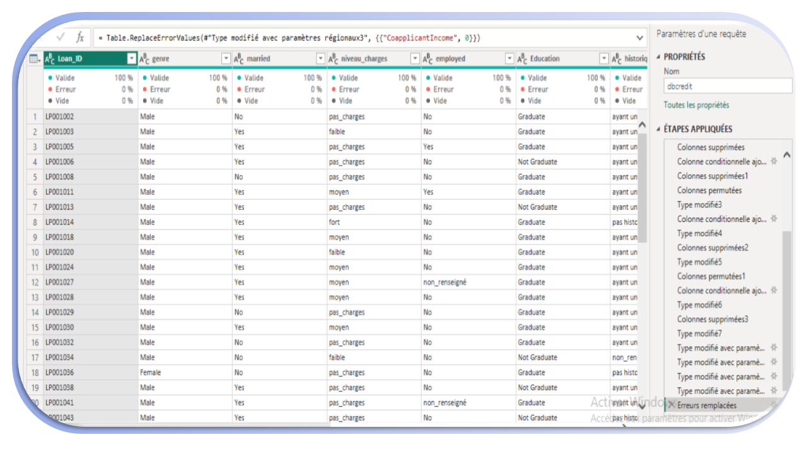
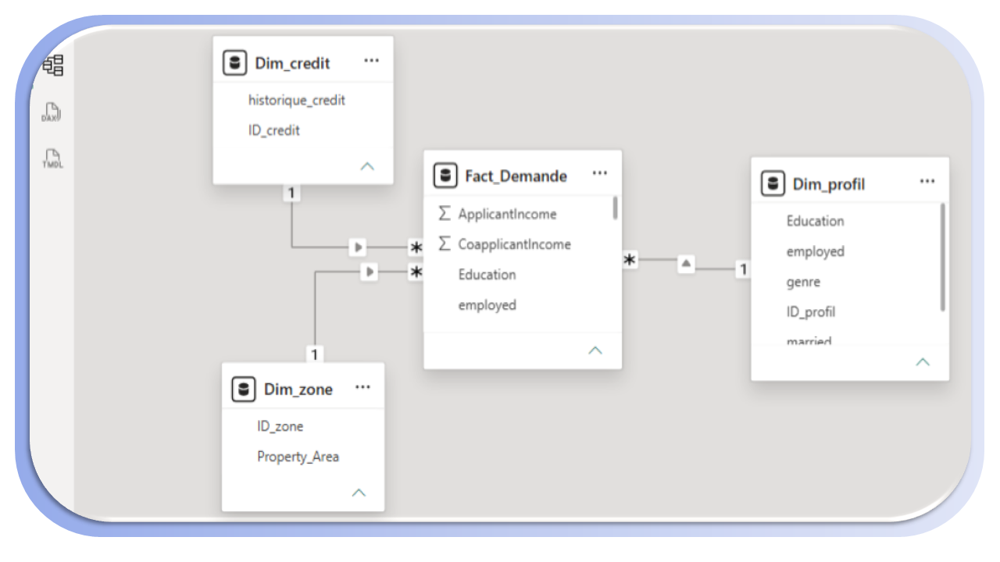
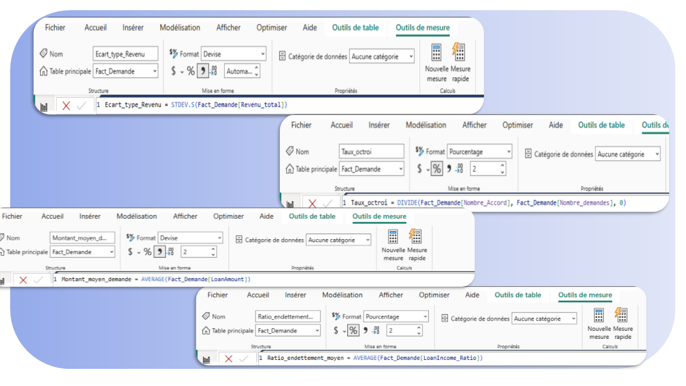
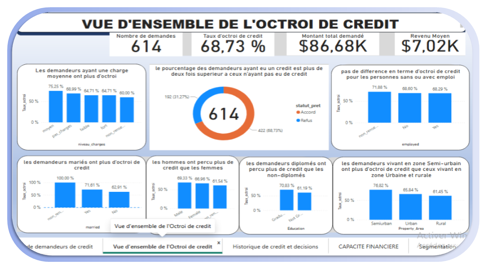
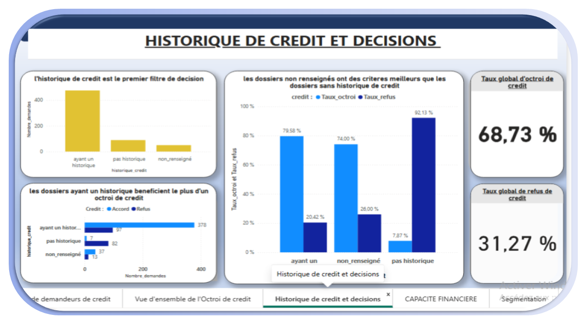
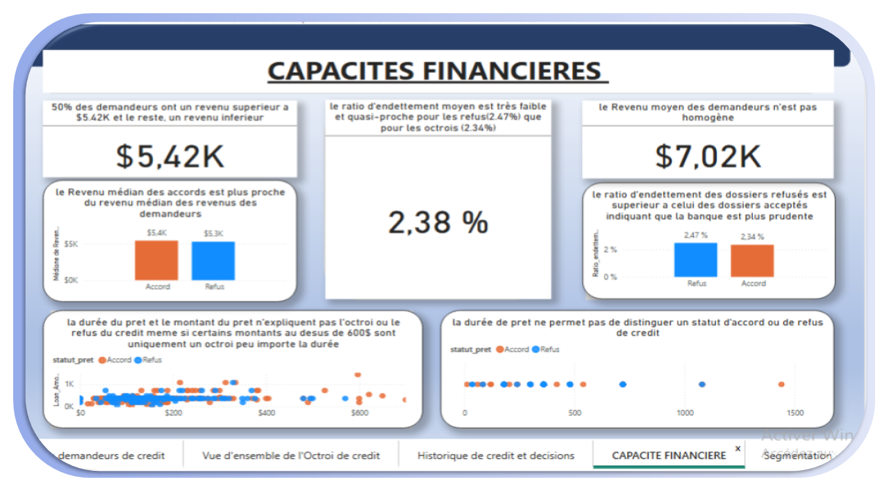
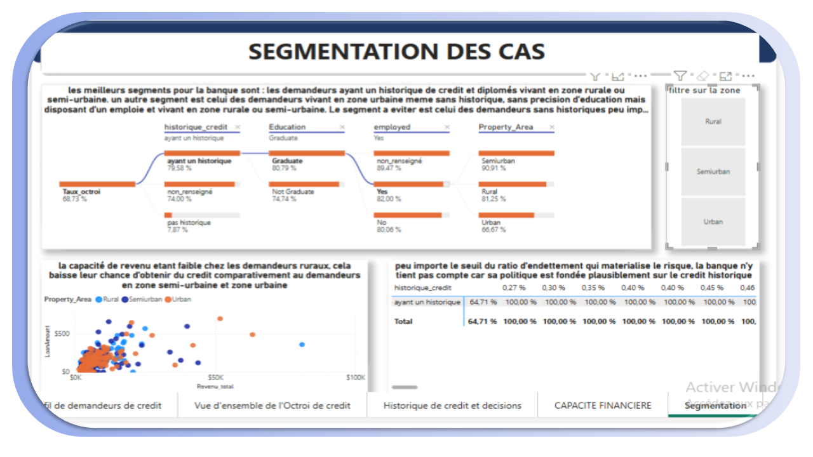
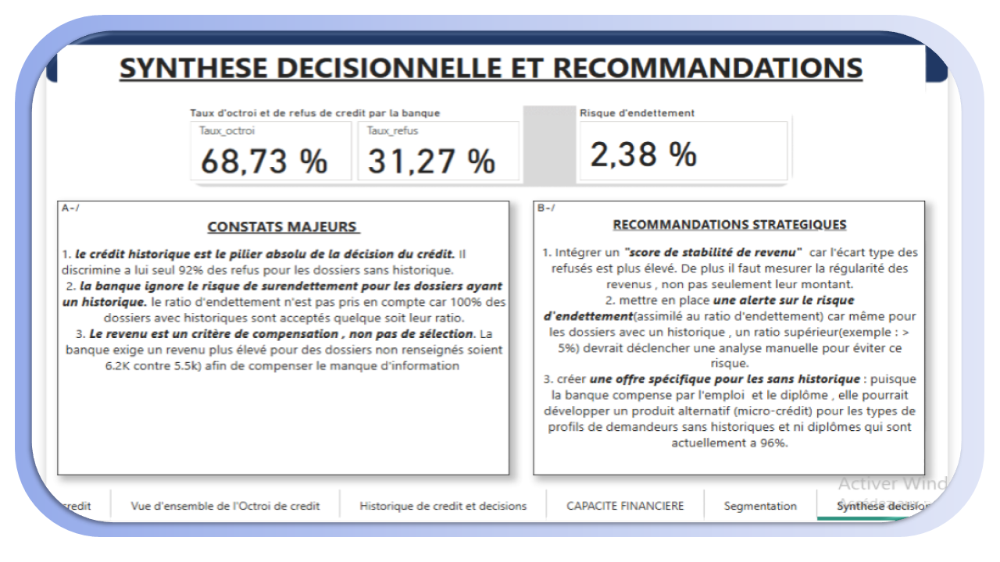

Analyse Décisionnelle des Demandes de Crédit — Power BI
***********************************************************************************************************************************************************************************

************************************************************************************************************************************************************************************
		Contexte du projet
************************************************************************************************************************************************************************************
Ce projet s’inscrit dans une démarche de Business Intelligence et de Data Analytics. 
Il vise à explorer les données historiques de 614 demandes de crédit afin de comprendre les logiques d’octroi, d’identifier des profils types et de formuler des recommandations stratégiques pour une institution financière.
Complémentarité avec le Machine Learning : Ce projet se concentre sur l’analyse descriptive et diagnostique (Que s’est-il passé ? Pourquoi ?), tandis qu’un projet ML viserait la prédiction (Que va-t-il se passer ?).

************************************************************************************************************************************************************************************
Objectifs analytiques
***********************************************************************************************************************************************************************************
	1.Caractériser la population des demandeurs.
	2.Mesurer l’association entre l’historique de crédit et la décision.
	3.Comparer les capacités financières (revenus, ratio d’endettement) des dossiers acceptés et refusés.
	4.Identifier des segments de décision (profils types).
	5.Transformer les résultats statistiques en recommandations métier.

	Insights clés
-----------------------------------------------------------------------------------------------------------------------------------------------------------------------------------------
		•L’historique de crédit est le pilier absolu : Il discrimine à lui seul 92% des refus pour les dossiers sans historique. Le taux d’octroi passe de 7,87% (sans historique) à 79,58% (avec historique).
		•Le revenu est un critère de compensation, pas de sélection : La banque exige un revenu plus élevé (6,2K vs 5,5K) pour les dossiers « non renseignés » afin de compenser le manque d’information.
		•Alerte sur le risque de surendettement : Pour les dossiers avec un historique, la banque accorde 100% des prêts, quel que soit le ratio d’endettement. Elle ignore le risque de surendettement actuel.

	Recommandations stratégiques
------------------------------------------------------------------------------------------------------------------------------------------------------------------------------------------
	
	1.Intégrer un « Score de Stabilité de Revenu » : L’écart-type des revenus des refusés est plus élevé. Il faut mesurer la régularité des revenus, pas seulement leur montant.
	2.Mettre en place une alerte sur le ratio d’endettement : Même avec un historique, un ratio supérieur à 5% devrait déclencher une analyse manuelle.
	3.Créer une offre spécifique pour les « sans historique » : Un produit alternatif (micro-crédit) pour les profils sans historique et non diplômés, actuellement rejetés à 96%.

	Contenu du dépôt
	--------------------------------------------------------------------------------------------------------------------------------------------------------------------------------------

	* data/ : Le jeu de données brut (dbcredit.csv).
	* powerbi/ : Le fichier source Power BI (credit_analysis.pbix).
	*documentation/ : Le rapport exporté au format PDF pour visualisation rapide, le dictionaire de données(dictionnary.md) et la methodologie de ce travail (Methodology.md)
	*screenshots/ : Les captures d’écran des 6 pages du rapport, un modèle de données,  un code DAX et une capture de powerquery des données
	*vizualisation/ : comportant les boxplots qui ont été importés pour etre utilisés lors de l'analyse

	Stack technique
	--------------------------------------------------------------------------------------------------------------------------------------------------------------------------------------
	* Power BI Desktop (Modélisation, DAX, Visualisation)
	* Power Query (Nettoyage, Feature Engineering)
	* Git/GitHub (Versioning)

	##### APERCU DU DASHBOARD
	----------------------------------------------------------------------------------

# Page 1 : Préparation des données (Power Query)

### Page 2 : Modèle de données (Schéma en étoile)

### Page 3 : Mesures DAX

### Page 4 : Profil des demandeurs

### Page 5 : Vue d'ensemble de l'octroi

### Page 6 : Historique de crédit et décisions

### Page 7 : Capacités financières

### Page 8 : Segmentation des cas

### Page 9 : Synthèse et Recommandations

	

	Auteur
	--------------------------------------------------------------------------------------------------------------------------------------------------------------------------------------
	Nom Prénom: KOUANANG FAMOU Michael
	Email : famoumike237@gmail.com
	
	LinkedIn: https://www.linkedin.com/in/michael-kouanang-famou-156ba4173
	GitHub: https://github.com/michaelfamou237-cyber
